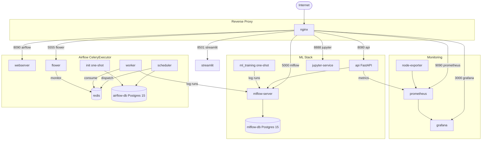
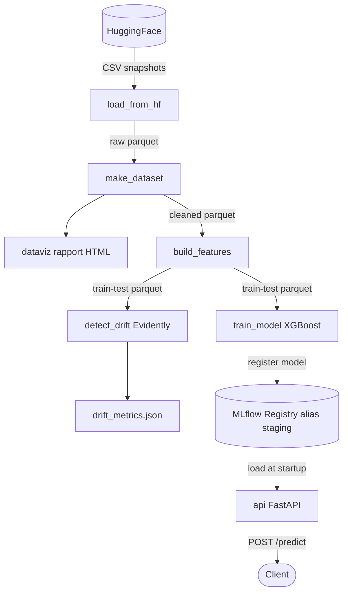
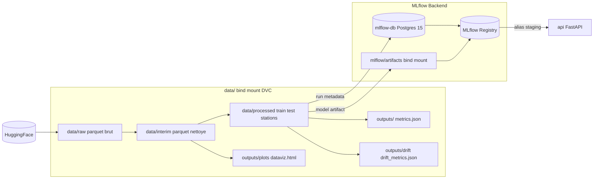
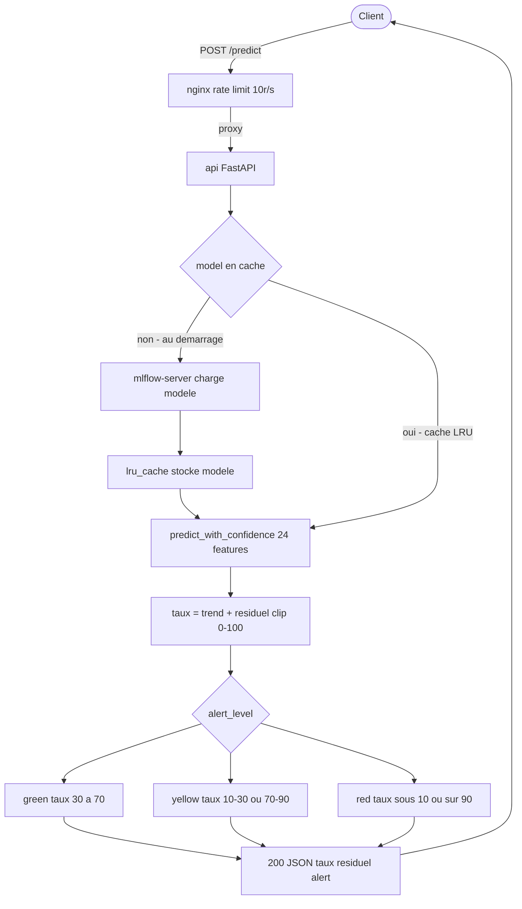
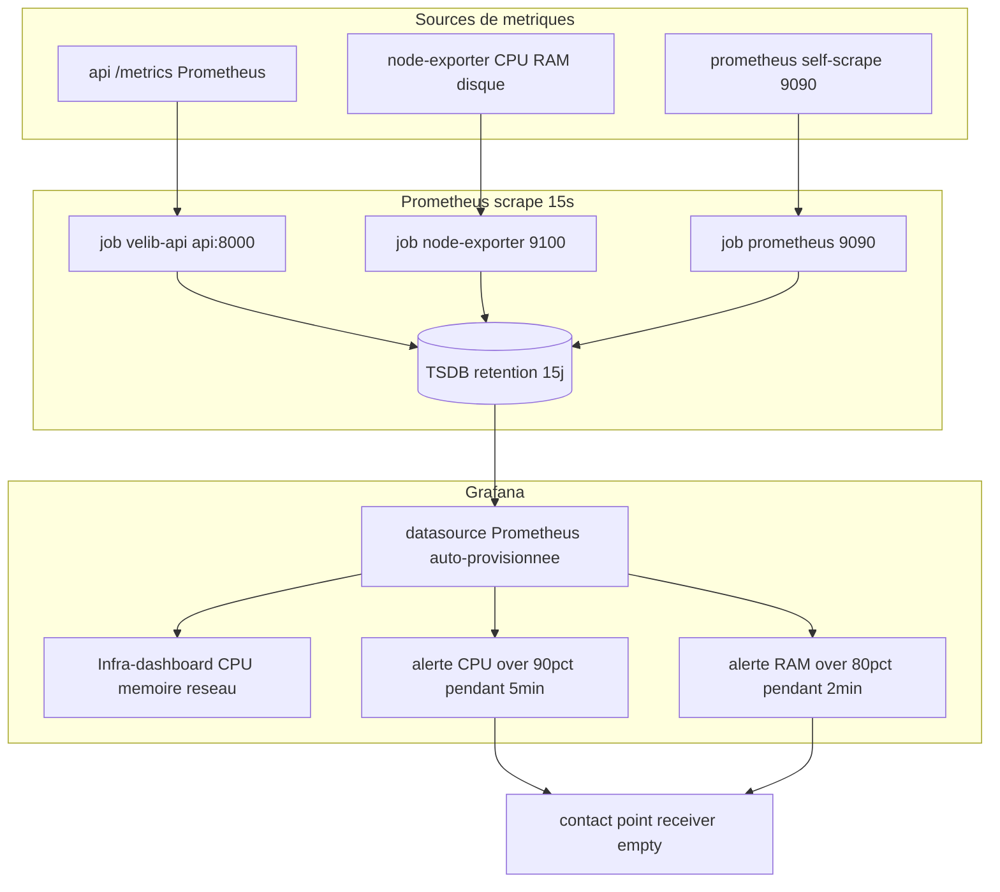
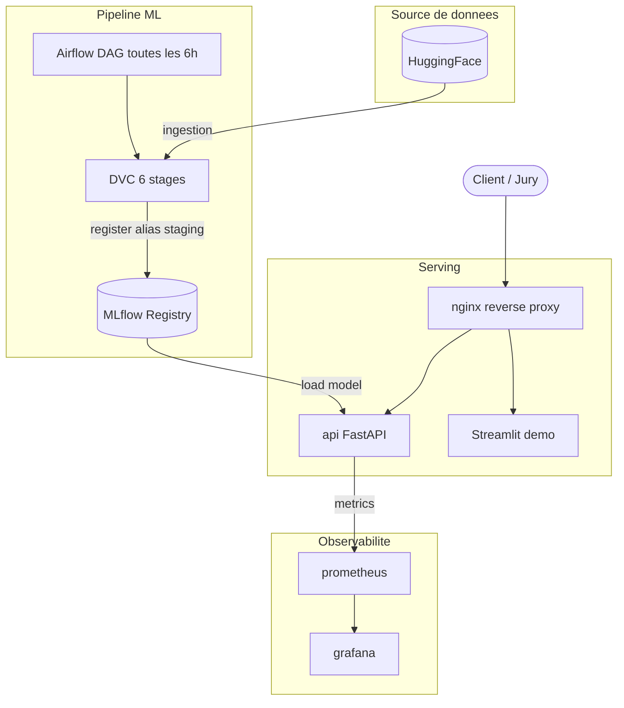

# Velib MLOps - Schemas d'architecture

## Architecture des conteneurs — 01_containers

---

## Pipeline ML de bout en bout — 02_pipeline

---

## Flux de données & artefacts — 03_data_flow

---

## Requête d'inférence — 04_inference

---

## Observabilité — 05_observability

---

## Vue d'ensemble — 00_overview

